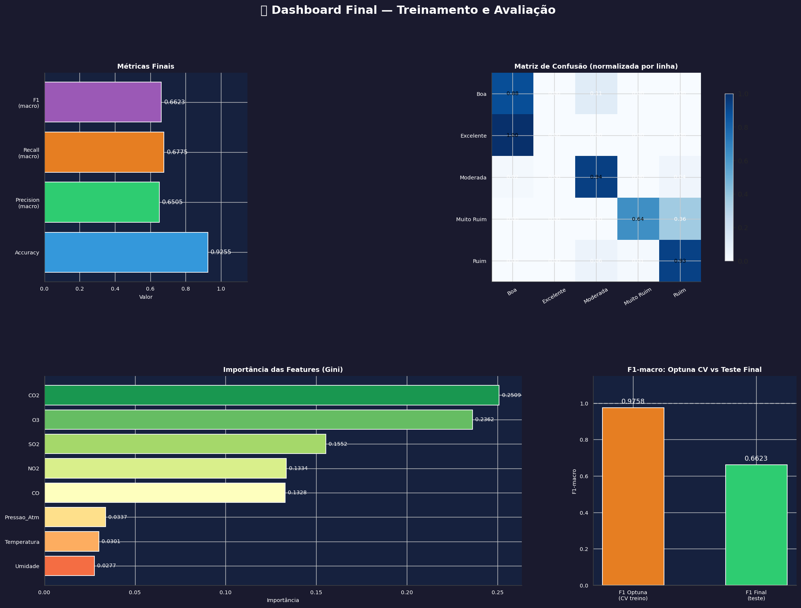
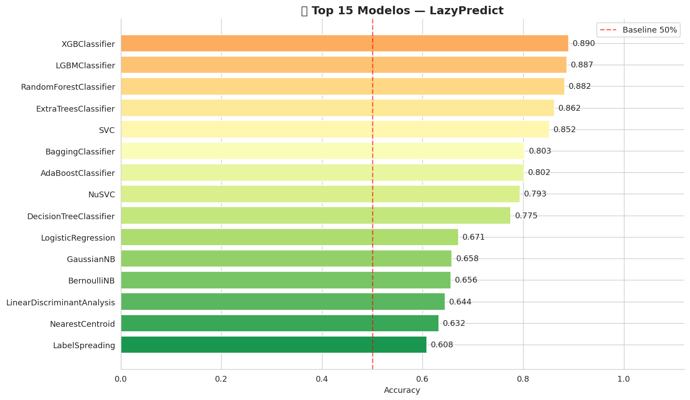
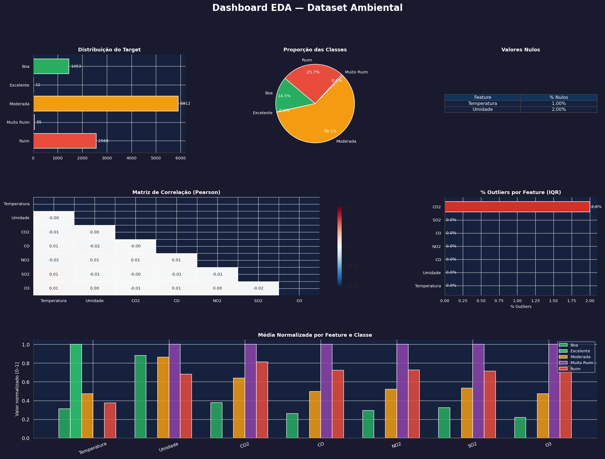
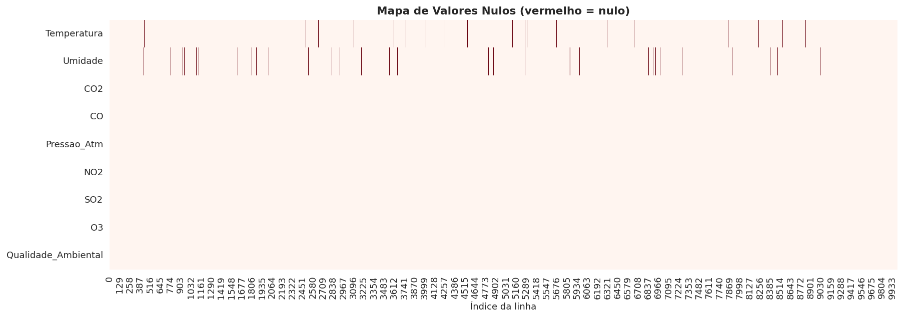
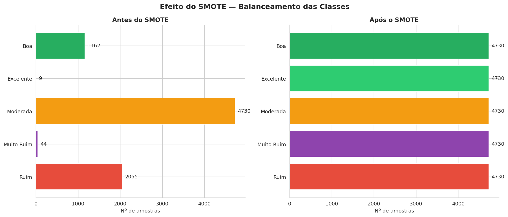
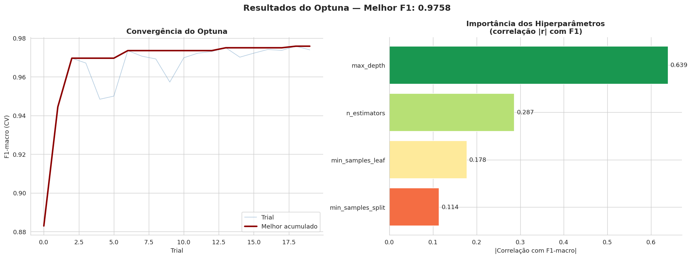
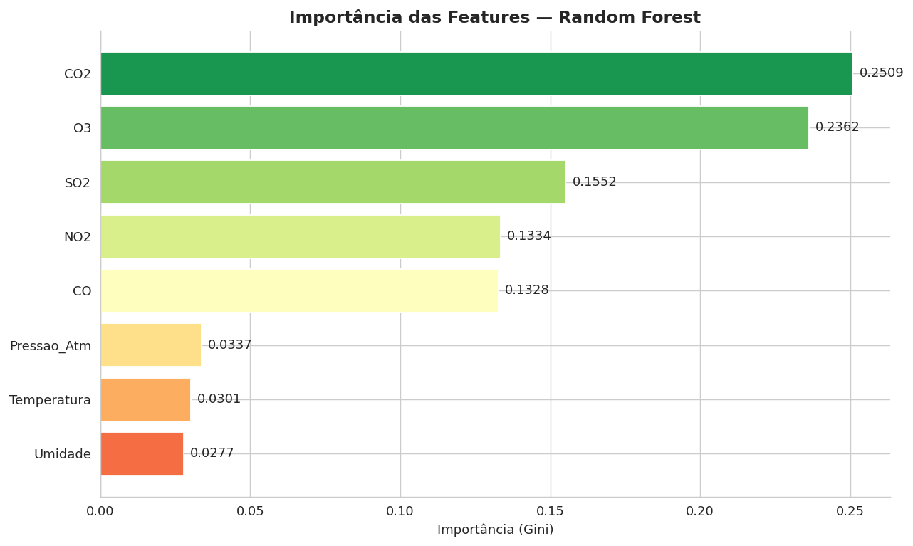
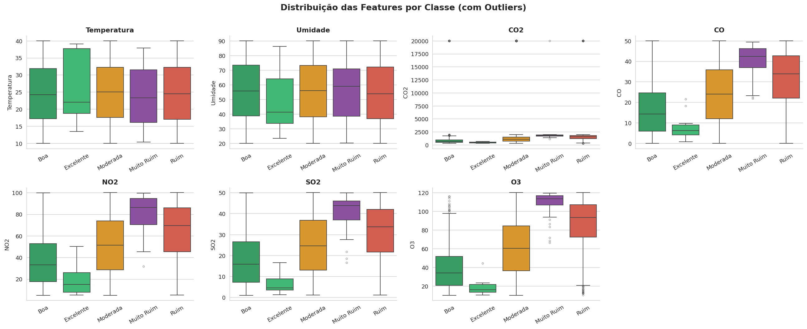
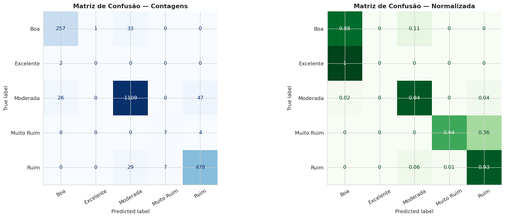

#  ML Pipeline: Classificação de Qualidade Ambiental

Este projeto implementa um sistema completo de **Machine Learning** para monitoramento e classificação da qualidade ambiental. Através da análise de poluentes gasosos e variáveis atmosféricas, o modelo categoriza o estado do ambiente em 5 níveis, desde "Excelente" até "Muito Ruim".



O projeto foi estruturado seguindo a metodologia **CRISP-DM** e utiliza práticas modernas de **MLOps** para garantir escalabilidade e reprodutibilidade.
---

##  Stack Tecnológica e Ferramentas

O projeto utiliza um ecossistema moderno voltado para a escalabilidade, reprodutibilidade e governança do ciclo de vida de Machine Learning (MLOps).

### **Core & Machine Learning**
* **Python 3.x**: Linguagem base para o desenvolvimento do pipeline.
* **Scikit-learn**: Implementação de Pipelines, Validação Cruzada Estratificada ($k=5$) e modelos de classificação.
* **XGBoost**: Algoritmo de Gradient Boosting de alta performance para dados tabulares.
* **Imbalanced-learn (SMOTE)**: Balanceamento robusto de classes com técnica de oversampling sintético ($k=3$).

### **MLOps & Governança de Experimentos**
* **MLflow**: Gerenciamento completo do ciclo de vida de ML, com rastreamento de parâmetros, métricas e versionamento de artefatos (backend SQLite).
* **Optuna**: Framework de otimização bayesiana para busca refinada de hiperparâmetros (HPT).
* **LazyPredict**: Benchmarking acelerado para ranking visual e seleção inicial de algoritmos competitivos.



### **Engenharia de Dados e Interface**
* **Streamlit**: Dashboard interativo para visualização de métricas em tempo real e interface de inferência para novas predições.
* **ydata-profiling**: Geração automatizada de relatórios detalhados de Análise Exploratória de Dados (EDA).
* **Matplotlib & Seaborn**: Bibliotecas para visualizações estatísticas e gráficos customizados de importância de features.

### **Infraestrutura e Portabilidade**
* **Docker**: Containerização completa da aplicação, garantindo paridade de ambiente entre desenvolvimento e produção.

---

##  Metodologia: CRISP-DM

### 1. Entendimento e Exploração dos Dados (EDA)
Análise profunda das variáveis para identificar padrões, anomalias e a distribuição do target.



* **Mapa de Nulos:** Identificação de dados faltantes para tratamento via Imputer.
* **Distribuições:** Análise de densidade (KDE) e histogramas das variáveis climáticas e poluentes.



### 2. Preparação de Dados
* **Limpeza:** Remoção de redundâncias e colunas constantes.
* **Balanceamento:** Aplicação de SMOTE para mitigar o desequilíbrio severo (originalmente 0.1% para a classe "Excelente").



### 3. Modelagem e Otimização
Tunagem refinada do modelo Random Forest utilizando busca bayesiana.



---

1.  **Entendimento do Negócio:** Classificação da qualidade ambiental baseada em sensores de gases e sensores climáticos.
2.  **Entendimento dos Dados:** EDA expandida com foco em correlações entre poluentes.
3.  **Preparação de Dados:** Tratamento de outliers, normalização e balanceamento de classes minoritárias.
4.  **Modelagem:** Otimização de hiperparâmetros e validação cruzada para garantir generalização.
5.  **Avaliação:** Análise técnica via F1-Score (macro) para medir o desempenho em todas as classes equitativamente.
6.  **Deployment:** Empacotamento via Docker e disponibilização de interface via Streamlit.

---

##  Variáveis do Modelo (Features)

O modelo utiliza dados de sensores que medem:
* **Poluentes (Gases):** $CO_2$, $CO$, $NO_2$, $SO_2$ e $O_3$.
* **Condições Climáticas:** Temperatura, Umidade e Pressão Atmosférica.

> **Insight:** Os poluentes **$CO_2$** e **$O_3$** são os principais preditores da qualidade ambiental, apresentando maior importância de Gini no modelo final.



---

##  Resultados e Performance

O modelo final (**Random Forest**) apresentou os seguintes resultados no conjunto de teste:

| Métrica | Valor |
| :--- | :--- |
| **Acurácia** | 92.25% |
| **F1-Score (Macro)** | 0.6602 |
| **Recall (Macro)** | 0.6746 |
| **Precision (Macro)** | 0.6492 |



### Destaques do Pipeline:
* **Otimização:** Foram realizados 50 trials no Optuna, alcançando estabilidade de convergência rápida.
* **Balanceamento:** O uso de SMOTE permitiu que o modelo aprendesse classes críticas que originalmente possuíam baixa representatividade.

---

##  Estrutura de Artefatos
Os seguintes componentes são gerados automaticamente pelo pipeline:
* `modelo_rf.joblib`: Modelo treinado e pronto para inferência.
* `pipeline_preproc.joblib`: Transformadores de dados (Scalers/Encoders).
* `resumo_experimento.txt`: Logs detalhados da execução.

---

##  Estrutura do Projeto
```
├── data/               # Dataset bruto
├── models/             # Modelos, transformadores e feature_names salvos
├── notebooks/          # Notebooks de experimentação interativa
├── src/                # Código fonte modularizado
│   ├── eda.py          # EDA completa, outliers e gráficos PNG
│   ├── preprocessing.py# Limpeza, Imputer, SMOTE e Stats
│   └── training.py     # Optuna, MLflow, Métricas Macro e Validação
├── app/                # Aplicação Streamlit (Dashboard + Previsão)
├── reports/            # Relatórios HTML e pasta figures/ com PNGs
├── main.py             # Orquestrador do pipeline completo
├── config.yaml         # Configurações centralizadas
├── requirements.txt    # Dependências do projeto
└── Dockerfile          # Configuração do container para deploy
```

##  Como Executar

### 1. Instalação Local
```bash
pip install -r requirements.txt
```

### 2. Executar o Pipeline Completo
O `main.py` orquestra todas as etapas: EDA -> Pré-processamento -> Benchmark -> Otimização -> Treinamento Final -> Verificação de Artefatos.
```bash
python main.py
```

### 3. Visualizar Experimentos (MLflow)
Para ver o histórico de execuções, métricas macro e artefatos (matriz de confusão, importância de features):
```bash
mlflow ui --backend-store-uri sqlite:///mlflow.db
```

### 4. Executar a Aplicação Web
```bash
streamlit run app/app.py
```

### 5. Docker
```bash
docker build -t ambiental-ml .
docker run -p 8501:8501 ambiental-ml
```
### windosws
```bash
QUICK-START-Windows.bat (como admin e docker  instalado)
```

##  Diferenciais Implementados
- **Limpeza Inteligente:** Remoção automática de colunas constantes, alta cardinalidade e redundantes (correlação > 0.95).
- **No Data Leakage:** Separação rigorosa entre treino e teste; Imputer e Scaler fitados apenas no treino.
- **Métricas Macro:** Foco no desempenho real em todas as classes, não apenas na majoritária.
- **Verificação de Artefatos:** Teste automático de integridade do modelo salvo antes de finalizar o pipeline.
- **Visualização Completa:** Mais de 10 gráficos gerados automaticamente para análise profunda.

---
*Este conteúdo é destinado apenas para fins educacionais. Os dados exibidos são ilustrativos e podem não corresponder a situações reais.*
